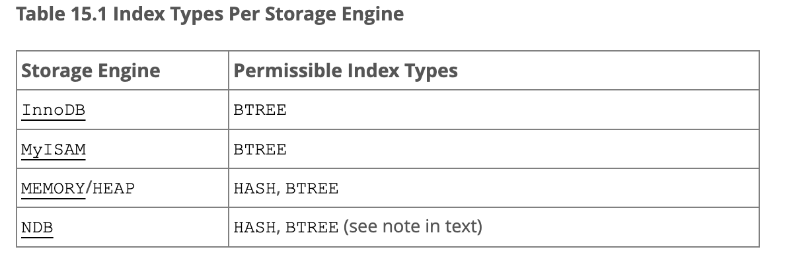
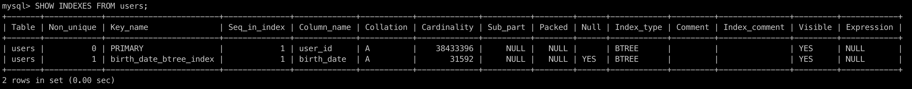
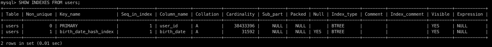

# HSA sql database
MySQL tuning

<h3>Task</h3>

1. Run select with different range of data, w/ and w/o index, compare results.

2. Run insert records script during 30 sec changing value for db setting ``innodb_flush_log_at_trx_commit``, compare results.

<h3>Description</h3>

Script generates 40M users on db startup (takes ~10 min)

Run selects when cache is turned off.
```
The query cache is deprecated as of MySQL 5.7.20, and is removed in MySQL 8.0.
https://dev.mysql.com/doc/refman/5.7/en/query-cache.html 
```

<h3>1. Select query w/ and w/o index</h3>


| Data range (%) | Query                                                                                                                                | Avg query time w/o index (sec) | Avg query time w/ index (sec) |
|----------------|--------------------------------------------------------------------------------------------------------------------------------------|--------------------------------|-------------------------------|
| < 5 %          | ```select count(*) from users where birth_date BETWEEN '1991-01-01' AND '1992-01-01';``` <br/>1253148 records, ~3,1% of all volume   | 15,12                          | 0,57                          |
| 10-15%         | ```select count(*) from users where birth_date BETWEEN '1991-01-01' AND '1995-10-01';``` <br/>5949489 records, ~14,9% of all volume  | 15,33                          | 2,67                          |
| > 30%          | ```select count(*) from users where birth_date BETWEEN '1991-01-01' AND '2001-01-01';``` <br/>12508459 records, ~31,3% of all volume | 15,77                          | 5,46                          |

Without index, we see similar results where main contribution is made by full table scan operation. BTREE index has improved query time, which is determined by search time in the index.

Explain analyze for query w/o index: <br/>
```
-> Aggregate: count(0)  (cost=4.35e+6 rows=1) (actual time=17032..17032 rows=1 loops=1)
    -> Filter: (users.birth_date between '1991-01-01' and '2001-01-01')  (cost=3.92e+6 rows=4.27e+6) (actual time=0.344..16642 rows=12.5e+6 loops=1)
        -> Table scan on users  (cost=3.92e+6 rows=38.4e+6) (actual time=0.339..8674 rows=40e+6 loops=1)
```
Explain analyze for query w/ index: <br/>
```
-> Aggregate: count(0)  (cost=5.78e+6 rows=1) (actual time=6256..6256 rows=1 loops=1)
    -> Filter: (users.birth_date between '1991-01-01' and '2001-01-01')  (cost=3.86e+6 rows=19.2e+6) (actual time=0.545..5874 rows=12.5e+6 loops=1)
        -> Covering index range scan on users using birth_date_index over ('1991-01-01' <= birth_date <= '2001-01-01')  (cost=3.86e+6 rows=19.2e+6) (actual time=0.02..3013 rows=12.5e+6 loops=1)
```
Creating HASH index produces output: <br/>
```
This storage engine does not support the HASH index algorithm, storage engine default was used instead.
```
BTREE index is created by default, there is no HASH index support for InnoDB: <br/>
https://dev.mysql.com/doc/refman/8.4/en/create-index.html





<h3>2. Insert records with different values for db setting innodb_flush_log_at_trx_commit </h3>

``innodb_flush_log_at_trx_commit`` values meaning

| Value  | Description                                                                             |
| ------------- |-----------------------------------------------------------------------------------------|
| 0  | Writes to the log and flushes to disk once per second, but does nothing for each commit |
| 1  | Writes to the log and flushes the log to disk every transaction. Default value          |
| 2  | Writes to the log every commit, flushes to disk once a second                           |

Build app
```
./gradlew clean build
```
Run app and script
```
docker-compose up -d
./insert-users.sh
```
Set dynamic value for ``innodb_flush_log_at_trx_commit``. Restart app to use new value in new session. 
```
SET GLOBAL innodb_flush_log_at_trx_commit=0;
SHOW VARIABLES LIKE 'innodb_flush_log_at_trx_commit';
```

Records created for different concurrency level = 0, 100, 200

| concurrent users | ``innodb_flush_log_at_trx_commit``=0                       | ``innodb_flush_log_at_trx_commit``=1                       | ``innodb_flush_log_at_trx_commit``=2                       |
|------------------|------------------------------------------------------------|------------------------------------------------------------|------------------------------------------------------------|
| 0                | 2610<br/>3949<br/>4348<br/>4439<br/>4427<br/>Avg: 3955     | 2974<br/>3861<br/>4015<br/>4108<br/>4141<br/>Avg: 3820     | 3083<br/>4017<br/>4343<br/>4415<br/>4510<br/>Avg: 4074     |
| 100              | 6127<br/>10060<br/>11561<br/>12412<br/>10555<br/>Avg: 10143 | 6331<br/>11554<br/>12258<br/>13498<br/>13845<br/>Avg: 11497 | 5835<br/>10512<br/>11775<br/>12598<br/>13157<br/>Avg: 10775 |
| 200              | 5883<br/>9543<br/>11231<br/>12632<br/>13450<br/>Avg: 10548 | 16120<br/>8554<br/>10725<br/>11107<br/>12051<br/>Avg: 10711 | 5963<br/>9784<br/>11700<br/>12518<br/>13220<br/>Avg: 10637 |

Сonclusions: applied load doesn't allow to reveal performance boost when changing value from 1 -> 2. It seems that current conditions are not enough to generate load on db to measure the effect.   